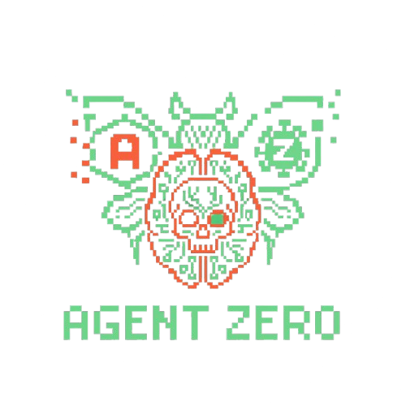

# Agent-Zero: LLM Staged Malware Analysis Tool

**Agent-Zero** is a staged static malware analysis framework that integrates traditional reverse-engineering tools with local Large Language Model (LLM) reasoning to produce structured, analyst-ready threat assessments. Operating inside an isolated Kali Linux Docker container , it bridges the gap between raw technical artifacts and human-level security insight.


---

## 🚀 Core Analysis Methodology

Agent-Zero follows a four-stage professional analysis pipeline, closely aligned with real-world malware research workflows.

| Stage | Focus | Description |
| --- | --- | --- |
| **Stage 1** | **Extraction** | Extracts ASCII/Unicode strings and uses **FLOSS** (v3.1.1) to recover obfuscated or runtime-decoded data. |
| **Stage 2** | **Categorization** | Groups Windows API usage and executes **CAPA** (v9.3.1) to identify capabilities and map them to **MITRE ATT&CK**. |
| **Stage 3** | **Enrichment** | Correlates indicators with **VirusTotal** reputation scores and **Hybrid Analysis** behavioral intelligence. |
| **Stage 4** | **Synthesis** | The local LLM synthesizes all data to produce a final verdict (Benign/Suspicious/Malicious) with confidence scoring and risk assessment. |

---

## ⚠️ Critical Security & Usage Disclaimer

> **⚠️ WARNING: MALWARE ANALYSIS IN PROGRESS**
> * **Static Analysis Only:** This tool is designed primarily for **static analysis**.
> * **Network Access:** Although Docker provides isolation, the framework requires outbound network access for threat-intelligence lookups (VirusTotal / Hybrid Analysis).
> * **Safety First:** Never execute malware samples on your host system. Always operate in controlled, isolated research environments.

---

## 🧠 Hardware & System Requirements

The intelligence core is powered by **Gemma 3:12b**, running locally via Ollama to ensure privacy and offline capability.

* **GPU:** Minimum **8 GB VRAM** (Optimized for NVIDIA RTX 2080-class hardware).
* **CPU:** Intel Core i5 or higher (x86_64 with virtualization support).
* **OS:** Linux (Preferred) or Windows with **WSL2** to ensure GPU passthrough.
* **Storage:** 20 GB+ free (For Docker images + ~7 GB LLM model).

---

## 🛠️ Installation & Setup

### 1️⃣ Install Ollama & Pull the Model

Ollama is used as the local inference engine for LLM reasoning.

```bash
# Install Ollama
curl -fsSL https://ollama.com/install.sh | sh

# Pull the primary model (Gemma 3:12b)
ollama pull gemma3:12b
````

> **Why Gemma 3:12b?**
> Selected for its **JSON parsing reliability** and balance of accuracy vs. resource usage on consumer hardware.

---

### 2️⃣ Configure API Keys

Create or edit the `env` file in the project root to enable external enrichment.

```bash
VT_API_KEY=your_virustotal_api_key
HYBRID_ANALYSIS_API_KEY=your_hybrid_analysis_api_key
```

These keys are optional but strongly recommended for Stage 3 enrichment.

---

### 3️⃣ Build & Start the Analysis Sandbox

Agent-Zero runs inside a custom Kali Linux Docker image for tool consistency and isolation.

```bash
sudo bash zero.sh start    # Build and start container (detached)
sudo bash zero.sh access   # Access the container shell
```

The workspace inside the container is located at: `/workspace`

---

## 💻 Usage

Once inside the container, Agent-Zero can be executed using either an interactive UI or a CLI workflow.

### ▶ Interactive Terminal UI (Recommended)

Best for learning, demonstrations, and visual analysis.

```bash
python3 agent-zero2.0.py
```

---

### ▶ Command-Line Interface (CLI)

Best for automated workflows or specific flag usage.

```bash
# Full staged static analysis
python3 Agent-Zero.py --file /workspace/theZoo/malwares/Binaries/sample.exe --model gemma3:12b

# VirusTotal reputation check only
python3 Agent-Zero.py --file sample.exe --vt-only
```

| Flag              | Description                                            |
| ----------------- | ------------------------------------------------------ |
| `--file`          | Path to the binary file to analyze.                    |
| `--model`         | LLM model to use (Default: `gemma3:12b`).              |
| `--vt-only`       | Skips LLM/Static tools; runs VirusTotal check only.    |
| `--no-dynamic`    | Skips Hybrid Analysis submission.                      |
| `--stage-reports` | Saves individual JSON reports for each analysis stage. |

---

## 📊 Integrated Tools & Capabilities

* **CAPA (v9.3.1):** Detects capabilities in executables and maps them to MITRE ATT&CK.
* **FLOSS (v3.1.1):** Uses advanced emulation to recover obfuscated strings and hidden configurations.
* **Local LLM (Gemma 3):** Synthesizes raw analysis artifacts into structured threat intelligence.
* **theZoo Dataset:** Includes a curated repository of real malware samples for controlled testing.

---

## 📁 Project Structure

```text
Agent-Zero/
├── Agent-Zero.py       # Main CLI Analysis Tool
├── agent-zero2.0.py    # Interactive Terminal UI
├── zero.sh             # Docker Management Script
├── Dockerfile          # Kali Linux Sandbox Definition
├── env                 # API Key Configuration
├── requirements.txt    # Python Dependencies
└── reports/            # Generated Analysis Output
```

---

## 📝 Project Information

* **Project Topic:** Static Malware Detection (Binary Classification)
* **Academic Year:** 2025 / 2026 — FALL
* **Author:** Meezok
* **Submission Date:** November 30, 2025

---

### 🔮 Future Work

* Integration of **Dynamic Analysis** tools (execution monitoring).
* Memory forensics support using **Volatility**.
* Support for **Linux/macOS** executable analysis.
* Fine-tuning the LLM on specific malware datasets.

---

## 📜 License

This project is intended for **educational and research purposes only**. Do not use this framework for unauthorized analysis or testing of systems you do not own or have permission to analyze.
